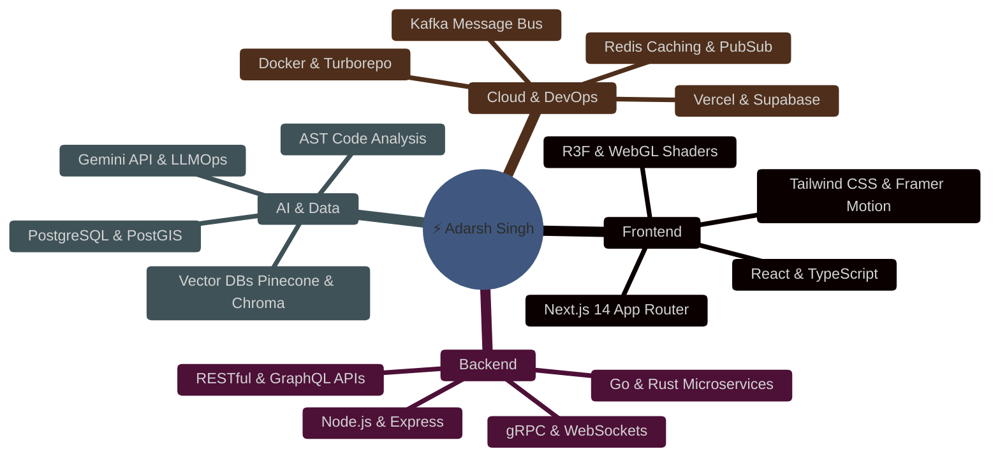
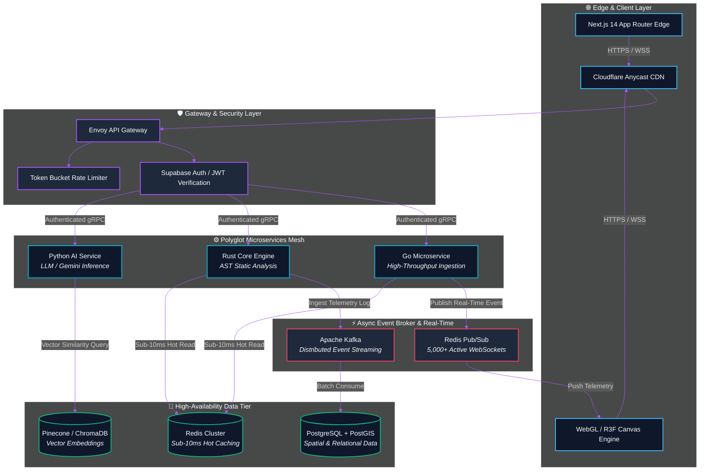
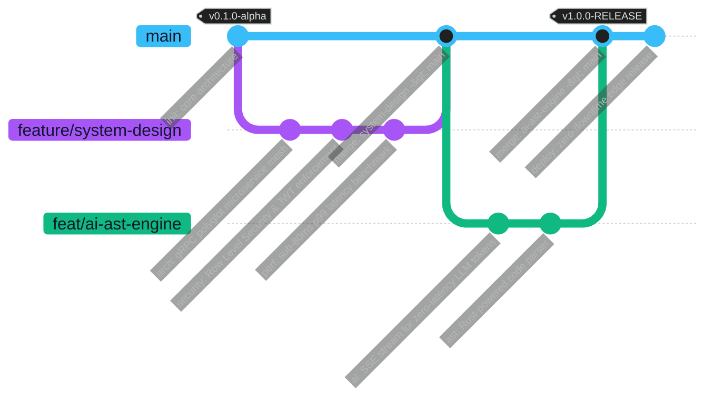

<p align="center">
  
</p>

<p align="center">
  <b>IT Undergrad (Class of '27) &bull; Systems Architect &bull; AI Systems & Polyglot Backends</b>
</p>

<p align="center">
  Architecting high-throughput microservices, sub-80ms p99 distributed systems, and real-time AI pipelines.
</p>

<p align="center">
  <a href="https://github.com/adarshthakur9240"></a>
  <a href="https://www.linkedin.com/in/adarsh-thakur-7683612a4"></a>
  <a href="mailto:singhadadarsh9240@gmail.com"></a>
  <a href="https://leetcode.com"></a>
</p>

<p align="center">
  
  
  
  
  
  
  
  
  
  
</p>

---

## 🧠 Tech Ecosystem



---

## 🚀 Flagship Projects Showcase

<table width="100%">
  <thead>
    <tr>
      <th width="40%">Project & Description</th>
      <th width="40%">Architecture & Tech Stack</th>
      <th width="20%">Access</th>
    </tr>
  </thead>
  <tbody>
    <tr>
      <td>
        <b>⚡ OckhamGrid</b><br/>
        <sub>Polyglot microservice mesh featuring an AI-driven Abstract Syntax Tree (AST) code reviewer and automated static analysis pipeline. Built for zero-latency distributed code audits.</sub>
      </td>
      <td>
        
        
        
        
        
      </td>
      <td>
        <a href="https://github.com/adarshthakur9240"><kbd> Repository </kbd></a><br/><br/>
        <a href="https://github.com/adarshthakur9240"><kbd> Docs / Arch </kbd></a>
      </td>
    </tr>
    <tr>
      <td>
        <b>📡 PawAlert</b><br/>
        <sub>Distributed Gov-Tech SaaS engineered with PostGIS geospatial telemetry and Redis Pub/Sub, broadcasting sub-10ms real-time data across 5,000+ active WebSockets with 99.9% message reliability.</sub>
      </td>
      <td>
        
        
        
        
        
      </td>
      <td>
        <a href="https://github.com/adarshthakur9240"><kbd> Repository </kbd></a><br/><br/>
        <a href="https://github.com/adarshthakur9240"><kbd> Live Demo </kbd></a>
      </td>
    </tr>
    <tr>
      <td>
        <b>💎 Qrento</b><br/>
        <sub>AI-driven consumer rental platform engineered over a Turborepo micro-frontend layout. Features PostgreSQL Row-Level Security (RLS) and sub-80ms p99 query latency.</sub>
      </td>
      <td>
        
        
        
        
      </td>
      <td>
        <a href="https://github.com/adarshthakur9240"><kbd> Repository </kbd></a><br/><br/>
        <a href="https://github.com/adarshthakur9240"><kbd> Live Demo </kbd></a>
      </td>
    </tr>
    <tr>
      <td>
        <b>📄 AI Resume Builder</b><br/>
        <sub>LLM-powered resourcing engine hosted on Vercel Edge functions. Utilizes Server-Sent Events (SSE) for sub-second token streaming and a 92% accurate AST keyword matcher.</sub>
      </td>
      <td>
        
        
        
        
      </td>
      <td>
        <a href="https://github.com/adarshthakur9240"><kbd> Repository </kbd></a><br/><br/>
        <a href="https://github.com/adarshthakur9240"><kbd> Live App </kbd></a>
      </td>
    </tr>
  </tbody>
</table>

---

## 🛠️ Generalized System Architecture Blueprint



---

## 🔄 Engineering Philosophy & Delivery Pipeline



---

## 📊 Telemetry & GitHub Analytics

<p align="center">
  
  
</p>

<p align="center">
  
</p>

---

## 💻 Terminal Contact Shell

```bash
$ npx adarsh-singh --connect
[⚡] Establishing TLS 1.3 handshake with adarshthakur9240... Done (11ms)

┌─────────────────────────────────────────────────────────────────────────┐
│                     ADARSH SINGH | SYSTEM TELEMETRY                     │
├─────────────────────────────────────────────────────────────────────────┤
│  🎓 Academic Track  : IT Undergrad (Class of '27)                      │
│  🎯 Specialization  : Systems Architecture & AI Engineering             │
│  🏆 Competitive     : LeetCode Knight (Peak Rating: 1868)              │
│  📧 Direct Mail     : singhadadarsh9240@gmail.com                        │
│  💼 LinkedIn        : linkedin.com/in/adarsh-thakur-7683612a4         │
│  🐙 GitHub Profile  : github.com/adarshthakur9240                       │
└─────────────────────────────────────────────────────────────────────────┘

$ echo "Constructing zero-latency systems for tomorrow's Web."
```

<details>
<summary><b>📜 System Verification & License Details</b></summary>
<br/>

```
Architect: Adarsh Singh
Repository: Portfolio Ecosystem v2.0
Protocol: MIT License
Status: Production Grade / Zero Downtime Deployment Enabled
```
</details>

<p align="center">
  <sub>Built with precision by <b>Adarsh Singh</b> &bull; Systems Architect</sub>
</p>